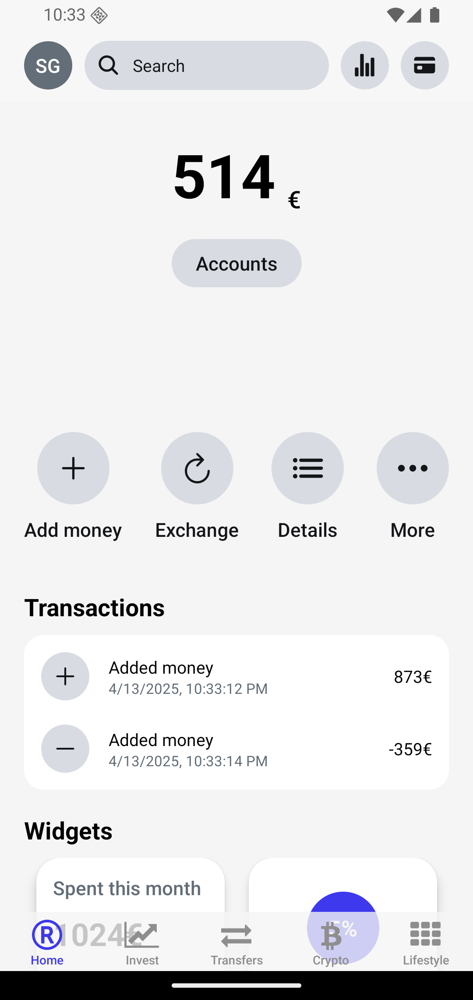
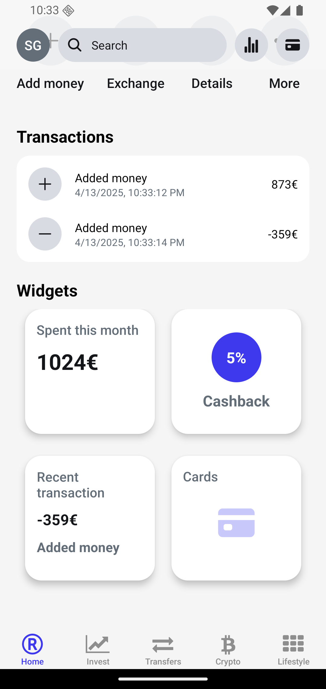
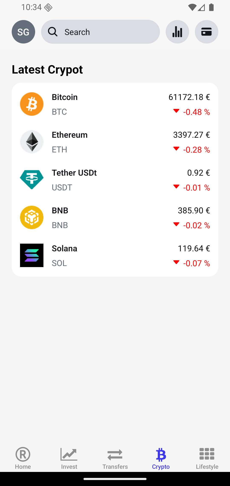
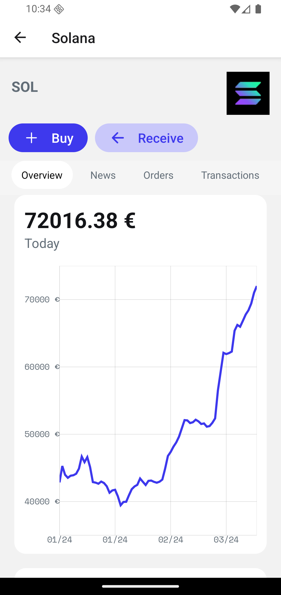

# 💸 Fintech Mobile Application

A modern, secure, and scalable **Fintech mobile app** built with **React Native** and **Expo Router**. This application enables seamless financial services with robust biometric authentication, real-time data handling, local secure storage, and fluid UI animations powered by Skia.

<p align="center">
  
  
  
</p>

---

## 📸 Preview

> 🎬 **Demo coming soon**  
> Below are preview screenshots of the app:

<p align="center">
   
  
  
  
  
  
  
  
</p>

---

## 🚀 Features

- 🔐 **Biometric Authentication** using `expo-local-authentication`
- 🔒 **Secure Auth Flows** powered by Clerk (`@clerk/clerk-expo`)
- 📊 **Interactive Charts** with `victory-native`
- 🎨 **Fluid Animations** using `@shopify/react-native-skia`
- 🧭 **Powerful Routing** with `expo-router`
- 💾 **Encrypted Storage** via `expo-secure-store` & `react-native-mmkv`
- ⚙️ **Dynamic App Icon Switching**
- 🔄 **Smart Data Caching & Fetching** using `@tanstack/react-query`
- 🧠 **Lightweight State Management** with `zustand`

---

## 🧱 Tech Stack

### 🧰 Core Stack

- **React Native** (with Expo SDK 52)
- **Expo Router**
- **TypeScript**

### 🖌️ UI & UX

- React Native Skia
- Zeego overlays
- Victory Native (charts)
- Expo Blur, Font, Haptics, Video

### 🔐 Auth & Security

- Clerk Authentication
- Biometric Login (Fingerprint/Face ID)
- Encrypted storage: Secure Store + MMKV

### 🔗 API & Data

- React Query (TanStack) for API/data management
- Date-fns for time formatting

---

## 🗂️ Folder Structure

```bash
.
├── app/                   # Route-based navigation (Expo Router)
│   ├── (authenticated)/(crypto)            # crypto info page
│   ├── (authenticated)/(modals)  #all ovelays
│   ├── (authenticated)/(tab)            # Main navigation tabs
│   ├── (api)/            # Main navigation tabs
│   ├── (verify)/            # verify number
│   └── _layout.tsx        # Global layout wrapper
├── components/            # Reusable UI components
├── constants/             # Static values (colors, fonts, config)
├── hooks/                 # Custom React hooks
├── services/              # API & backend logic
├── store/                 # Zustand store (global state)
├── types/                 # Shared TypeScript types
├── utils/                 # Helper functions
└── scripts/               # Project utility scripts
```

---

## 🧪 Running Locally

### 🔄 Step 1: Clone the repository

```bash
git clone https://github.com/your-username/fintech.git
cd fintech
```

### 📦 Step 2: Install dependencies

```bash
npm install
# or
yarn
```

### ▶️ Step 3: Run the development server

```bash
npx expo start
```

---

## 🧪 Testing

Run all tests with:

```bash
npm test
```

Powered by **Jest** and **Jest-Expo**.

---

## 🤝 Contribution

We welcome PRs and feature suggestions!

1. Fork the repo
2. Create your feature branch (`git checkout -b feature/new-feature`)
3. Commit your changes (`git commit -m 'Add some feature'`)
4. Push to the branch (`git push origin feature/new-feature`)
5. Open a pull request

Please follow our style and naming conventions.

---

## 📜 License

This project is licensed under the **MIT License**.  
See the [LICENSE](./LICENSE) file for more details.

---

## 👨🏽‍💻 Author

**Chinedu Aguwa**  
📧 [neduaguwa443@gmail.com](mailto:neduaguwa443@gmail.com)  
📞 +234 810 547 1046  
[LinkedIn](https://www.linkedin.com/in/chinedu-aguwa-b1747a2b0) • [GitHub](https://github.com/chi2785443)
